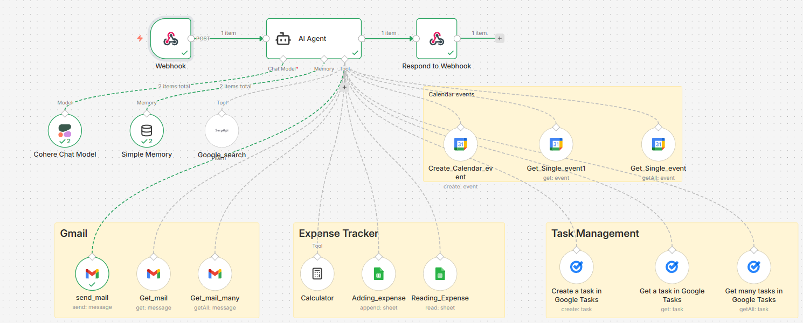

# 🤖 AI Personal Assistant (n8n + Streamlit)

An intelligent AI-powered personal assistant that automates daily tasks like managing emails, scheduling events, tracking expenses, and handling to-do lists.

This project integrates n8n (workflow automation), Cohere LLM, and a Streamlit-based chat interface.

---

## 🚀 Features

- 💬 Conversational AI assistant  
- 📧 Send, read, and summarize emails  
- 📅 Create and manage calendar events  
- ✅ Manage tasks and to-do lists  
- 💰 Track and analyze expenses  
- ⚡ Real-time chat interface  

---

## 🏗️ System Architecture

- **Frontend**: Streamlit (Chat UI)
- **Backend**: n8n AI Agent (Webhook-based)
- **LLM**: Cohere Chat Model
- **Memory**: Simple Memory (n8n)

### 🔧 Integrated Tools:
- Gmail (send/read emails)
- Google Calendar (events)
- Google Tasks (task management)
- Google Sheets (expense tracker)
- Calculator

---

## 🔄 Workflow

1. User sends a message via Streamlit UI  
2. Request is sent to n8n Webhook  
3. AI Agent processes the request  
4. Agent either:
   - Responds directly OR  
   - Calls a tool (Gmail, Calendar, etc.)  
5. Response is returned to Streamlit  

## 🖼️ n8n Workflow

Below is the workflow of the AI agent built using n8n:

